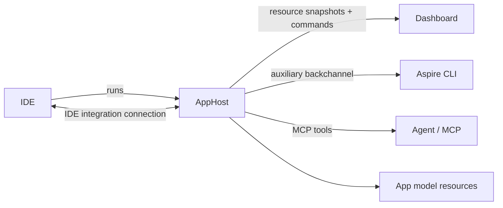

# Future IDE integration

## Summary

Aspire's IDE integration should evolve from a debugging-specific execution protocol into a bidirectional integration between the AppHost and the IDE that exposes IDE-owned per-resource behaviors as Aspire resource commands.

The IDE still owns launching the AppHost. Once the AppHost is running, the IDE and AppHost establish an authenticated local connection. Aspire uses that connection to discover IDE capabilities, merge IDE-provided commands into each resource, and execute those commands on behalf of humans, dashboard UI, CLI clients, and agents.

## Background

The current [IDE execution protocol](IDE-execution.md) is centered on DCP delegating executable run sessions to an IDE. It answers questions such as:

- Can this resource be launched by the IDE?
- What launch configuration should DCP send?
- How does DCP stop the run session?
- How does the IDE notify DCP that a process restarted, terminated, or emitted logs?

That remains useful, but it is too narrow for future Aspire scenarios. Debugging is only one IDE-owned behavior. IDEs can also expose attach and detach debugger operations, C# hot reload, test actions, source navigation, package restore, project reload, launch profile selection, browser tooling, and extension-specific resource actions.

Aspire already has a control-plane abstraction for per-resource actions: resource commands. Resource commands are visible in the Dashboard, available through the CLI/API backchannel, and can be surfaced to agents through MCP. Future IDE integration should plug into that command model instead of creating a parallel IDE-specific action surface.

Recent DCP work in [microsoft/dcp#172](https://github.com/microsoft/dcp/pull/172) is an example of the current extension direction. It introduces a top-level `IdeSession` resource so tools can create stand-alone IDE debug sessions for workloads that are not modeled as DCP `Executable` resources, such as Blazor WebAssembly clients. It also extracts the reusable IDE handshake, notification stream, request/response payloads, and run-session lifecycle into an internal IDE client shared by `IdeExecutableRunner` and the new `IdeSession` controller.

That validates two important ideas for this future Aspire design:

1. IDE capabilities need to apply beyond executable resource launch.
2. IDE integration should be exposed as controllable resource-oriented API, not hidden inside one runner implementation.

The proposed AppHost-to-IDE command integration builds on that direction and generalizes it from "create an IDE debug session" to "discover and invoke IDE-provided commands for each Aspire resource."

## Goals

1. Allow the IDE to contribute per-resource commands after the AppHost starts.
2. Allow the IDE to advertise functionality it can provide for Aspire resources, projects, and executables.
3. Surface IDE commands through existing Aspire command channels, including Dashboard UI, CLI, API, and MCP/agent tooling.
4. Allow commands to be resource-specific, stateful, dynamically enabled or disabled, and argument-driven.
5. Support debugging-related operations without making the protocol debugging-specific.
6. Keep the IDE in control of IDE-specific behavior while making Aspire the control plane for discovery, invocation, authorization, telemetry, and UX projection.
7. Support incremental adoption by existing IDE execution implementations.

## Non-goals

1. Replacing the existing IDE execution protocol in the first iteration.
2. Defining every possible IDE command shape up front.
3. Requiring the AppHost to know IDE implementation details such as Visual Studio, VS Code, or Rider command IDs.
4. Making IDE commands available in publish/deployment mode.
5. Allowing arbitrary remote IDE connections. The initial protocol is local-machine development infrastructure.

## Conceptual model



The IDE starts the AppHost and provides connection metadata in the AppHost environment. The AppHost connects back to the IDE integration endpoint and negotiates capabilities. The IDE can then advertise functionality for resources in the AppHost model and contribute command descriptors for that functionality. Aspire merges those descriptors with AppHost-defined resource commands and exposes the result everywhere resource commands already appear.

When a user or agent invokes an IDE command, Aspire validates the request, records command telemetry, forwards the invocation to the IDE, and maps the IDE response back to the standard resource command result shape.

## Design principles

### Aspire is the control plane

Aspire owns the resource graph, command discovery surface, command invocation surface, telemetry correlation, cancellation, and user/agent-facing results. IDEs contribute capabilities; clients do not call IDEs directly.

### IDEs own IDE behavior

The IDE decides what it can do for each resource. Aspire should not hard-code that Visual Studio supports one set of commands while VS Code supports another. The IDE reports commands based on installed extensions, project system state, debugger state, source language, target framework, and current resource state.

### Commands are the unit of integration

Attach debugger, detach debugger, hot reload, restart with debugger, open source, run tests, or extension-specific actions are all represented as resource commands. This gives humans and agents one consistent way to discover and invoke behavior.

### Command names are stable and machine-readable

Each IDE command has a stable command name that agents can call. Display names and descriptions are presentation metadata. Names should use a namespaced form to avoid collisions, for example `ide.debug.attach`, `ide.debug.detach`, and `ide.dotnet.hotReload`.

### IDE commands are dynamic

IDE commands can appear, disappear, or change state as projects load, resources start, processes restart, debug sessions attach, or extensions become available. Aspire must support watching command changes rather than treating command descriptors as static AppHost model data.

## Protocol overview

The IDE integration protocol is a local, authenticated, AppHost-to-IDE protocol. The IDE starts the AppHost with connection metadata. The AppHost connects to the IDE and uses request/response calls plus streaming notifications.

The protocol has four layers:

1. **Session negotiation**: version and capability discovery.
2. **Resource capability discovery**: IDE-advertised functionality for resources, projects, and executables.
3. **Resource command discovery**: IDE-contributed command descriptors and state derived from those capabilities.
4. **Resource command execution**: invocation, cancellation, progress, and results.

The exact transport can be HTTP + WebSocket, JSON-RPC over a local stream, or another local authenticated transport. The first implementation should prefer the transport that best fits the existing Aspire auxiliary backchannel and IDE execution infrastructure, but the contract should stay transport-neutral at the model level.

## Session bootstrap

When the IDE starts the AppHost, it provides environment variables that let the AppHost connect to the IDE integration endpoint.

| Environment variable | Description |
| --- | --- |
| `ASPIRE_IDE_SESSION_ENDPOINT` | Local endpoint URI for the IDE integration session. |
| `ASPIRE_IDE_SESSION_TOKEN` | Bearer token or equivalent secret used to authenticate AppHost requests. |
| `ASPIRE_IDE_SESSION_INFO` | Optional cached session info JSON used as a startup optimization. |

The existing `DEBUG_SESSION_*` environment variables remain specific to DCP IDE execution. They can be bridged by an IDE during transition, but the new integration should not use debug-specific names.

## Session negotiation

The AppHost asks the IDE for session information:

```jsonc
{
  "protocols_supported": [ "2026-06-01" ],
  "ide": {
    "id": "visualstudio",
    "display_name": "Visual Studio",
    "version": "18.0"
  },
  "capabilities": [
    "ide.resourceCapabilities.v1",
    "ide.commands.v1",
    "ide.commandExecution.v1",
    "ide.commandProgress.v1"
  ]
}
```

Capability names are additive. The AppHost should enable only features supported by both sides. Unknown capabilities must be ignored.

## Resource identity

The AppHost is authoritative for Aspire resource identity. IDE command APIs identify resources by Aspire resource name and optional replica identity.

```jsonc
{
  "resource_name": "api",
  "replica": "api-0"
}
```

The AppHost may include optional resource metadata when asking the IDE for commands:

```jsonc
{
  "name": "api",
  "type": "project",
  "project_path": "/repo/src/Api/Api.csproj",
  "state": "Running",
  "health_status": "Healthy",
  "endpoints": [
    {
      "name": "https",
      "uri": "https://localhost:7191"
    }
  ]
}
```

The IDE must treat resource metadata as a hint. The AppHost remains the source of truth for resource state.

## Resource capability discovery

Before exposing commands, the AppHost and IDE need a shared way to discover what the IDE understands about the current app model. The IDE should be able to advertise functionality against:

1. Aspire resources, identified by resource name and optional replica identity.
2. Project resources, identified by project path, target framework, launch profile, and project system identity when known.
3. Executable/container resources, identified by executable path, working directory, process ID, container ID, launch configuration, and runtime metadata when known.

This capability layer lets the IDE say "I can debug this project", "I can hot reload this C# process", "I can open this source tree", or "I can provide browser tools for this endpoint" without requiring Aspire to understand IDE-specific project systems or extension state.

```jsonc
{
  "resources": [
    {
      "name": "api",
      "capabilities": [
        {
          "name": "ide.debug.attach",
          "state": "available",
          "scope": "replica",
          "reason": "A running .NET process was matched to this project."
        },
        {
          "name": "ide.dotnet.hotReload",
          "state": "available",
          "scope": "resource",
          "reason": "The project supports .NET hot reload."
        }
      ],
      "matched_projects": [
        {
          "path": "/repo/src/Api/Api.csproj",
          "target_framework": "net10.0",
          "language": "C#"
        }
      ],
      "matched_executables": [
        {
          "path": "/repo/src/Api/bin/Debug/net10.0/Api",
          "process_id": 42117,
          "working_directory": "/repo/src/Api"
        }
      ]
    }
  ]
}
```

Capabilities are not directly user-facing commands. They are the IDE's explanation of what functionality is available and why. The AppHost uses them to build, refresh, enable, disable, or hide IDE command descriptors. This keeps the public Aspire surface command-oriented while leaving room for richer IDE matching logic behind the scenes.

The AppHost should provide enough resource metadata for the IDE to match resources confidently, but the IDE should tolerate partial information. For example, a project resource may not have a process ID until it is running, and an executable resource may not map back to a project file.

Capability discovery should support both an initial snapshot and incremental updates. Updates are needed when:

1. The app model changes.
2. A project loads or unloads in the IDE.
3. A resource starts, stops, or restarts.
4. A debugger attaches or detaches.
5. Hot reload availability changes.
6. IDE extensions add or remove functionality.

## Command discovery

The IDE exposes a way for the AppHost to get and watch IDE commands for resources. Commands are the user-facing projection of the capability discovery layer.

```jsonc
{
  "resources": [
    {
      "name": "api",
      "commands": [
        {
          "name": "ide.debug.attach",
          "display_name": "Attach debugger",
          "description": "Attach the IDE debugger to the running api process.",
          "state": "enabled",
          "visibility": "UI, Api",
          "icon": {
            "name": "Bug",
            "variant": "Regular"
          }
        },
        {
          "name": "ide.dotnet.hotReload",
          "display_name": "Apply hot reload",
          "description": "Apply pending C# hot reload changes.",
          "state": "disabled",
          "disabled_reason": "No pending changes were detected.",
          "visibility": "UI, Api"
        }
      ]
    }
  ]
}
```

Aspire projects these descriptors into resource snapshots alongside AppHost-defined commands. IDE commands should be marked internally as IDE-originated so execution can be routed back to the IDE.

### Command descriptor

| Property | Required | Description |
| --- | --- | --- |
| `name` | Yes | Stable machine-readable command name. |
| `display_name` | Yes | Localized user-visible name supplied by the IDE. |
| `description` | No | Localized user-visible description. |
| `state` | Yes | `enabled`, `disabled`, or `hidden`. |
| `disabled_reason` | No | User-visible reason when disabled. |
| `visibility` | No | Same meaning as Aspire resource command visibility. Defaults to `UI, Api`. |
| `arguments` | No | Optional Aspire interaction input metadata. |
| `confirmation_message` | No | Optional confirmation text before execution. |
| `icon` | No | Optional icon metadata for UI clients. |
| `is_highlighted` | No | Whether the command should be emphasized in UI. |

The descriptor intentionally mirrors existing Aspire resource command metadata. New metadata should be added only when it can be projected to Dashboard, CLI/API, and MCP clients consistently.

## Command execution

When a client invokes an IDE command through Aspire, the AppHost forwards the request to the IDE:

```jsonc
{
  "resource_name": "api",
  "replica": "api-0",
  "command_name": "ide.debug.attach",
  "arguments": {
    "just_my_code": true
  },
  "trace_context": {
    "trace_parent": "00-...",
    "trace_state": "..."
  }
}
```

The IDE returns a result that maps to `ExecuteCommandResult`:

```jsonc
{
  "success": true,
  "message": "Debugger attached.",
  "data": {
    "value": "{ \"debugSessionId\": \"...\" }",
    "format": "json",
    "display_immediately": false
  }
}
```

Failures must be explicit:

```jsonc
{
  "success": false,
  "message": "The api process is not running."
}
```

The AppHost should not convert transport failures into success-shaped command results. If the IDE connection is unavailable, IDE commands should become disabled or hidden and command execution should fail with a clear message.

Some commands may be implemented directly by the IDE integration endpoint. Others may be backed by DCP resources. For example, a command such as `ide.debug.startSession` for a Blazor WebAssembly resource could create a DCP `IdeSession` resource, set `Spec.DesiredState` to `Running`, stream the session status/logs, and return the final status through the normal resource command result. That keeps the user and agent surface consistent while allowing DCP to own the lower-level lifecycle.

## Progress and cancellation

Some IDE commands may be long-running, such as attaching a debugger, applying hot reload, or starting a diagnostic session. The protocol should support:

- command invocation IDs,
- cancellation from Aspire to the IDE,
- progress events from the IDE to Aspire,
- final result correlation.

Progress events can initially be logged to the resource command logger. A later Dashboard experience can render progress inline.

## Recommended well-known commands

The protocol does not require a fixed command set, but these names should be reserved for common agent and UI workflows:

| Command name | Description |
| --- | --- |
| `ide.debug.attach` | Attach the IDE debugger to the resource. |
| `ide.debug.detach` | Detach the IDE debugger from the resource. |
| `ide.debug.restart` | Restart the resource under the debugger when supported. |
| `ide.debug.startSession` | Start a new IDE debug session for resources that need an explicit session lifecycle. |
| `ide.dotnet.hotReload` | Apply C# hot reload changes for a .NET resource. |
| `ide.source.open` | Open the resource's primary source/project in the IDE. |
| `ide.tests.run` | Run tests associated with the resource. |

IDEs may add their own namespaced commands. Aspire should not special-case command behavior except for optional UX affordances tied to well-known names.

## Agent behavior

Agents discover IDE commands the same way they discover any resource command:

1. List resources.
2. Inspect each resource's commands.
3. Invoke a command by resource name and command name.
4. Read the command result.

Agents should not need to know which IDE is connected. They should rely on command names, descriptions, argument metadata, enabled state, and results. If a command is unavailable, the command state should explain why.

This makes Aspire the shared control plane for humans and agents:

- Humans see commands in Dashboard or IDE-integrated Aspire UI.
- CLI users invoke commands with normal resource command syntax.
- Agents invoke commands through MCP tools backed by the same AppHost command surface.

## Dashboard and CLI projection

Dashboard and CLI should not need IDE-specific APIs. They consume the normal resource snapshot command metadata. The AppHost is responsible for merging AppHost-defined commands and IDE-contributed commands.

If a command name collision occurs, AppHost-defined commands win. IDE commands should use the `ide.` prefix to avoid collisions.

## Security

The IDE integration endpoint is local development infrastructure and must be authenticated.

Requirements:

1. The IDE provides an unguessable session token when launching the AppHost.
2. The AppHost sends the token on every IDE integration request.
3. The IDE accepts requests only from the local machine unless a later spec explicitly defines remote scenarios.
4. Command descriptors must not include secrets.
5. Command arguments and results must follow existing Aspire command redaction and telemetry rules.
6. Agents do not receive the IDE session token; they invoke commands through Aspire.

## Versioning

The protocol should use dated protocol versions, matching the style of the existing IDE execution protocol.

Capabilities should be additive and independently negotiable. Breaking changes require a new protocol version. Optional properties can be added without changing the version if older clients can ignore them safely.

## Relationship to IDE execution

IDE execution remains the mechanism by which DCP delegates process launch to an IDE. Future IDE integration is broader:

| Area | IDE execution | DCP `IdeSession` | Future IDE integration |
| --- | --- | --- | --- |
| Primary purpose | Launch/stop executable run sessions | Start/stop stand-alone IDE debug sessions | Expose IDE capabilities as resource commands |
| Main caller | DCP executable runner | DCP resource controller | AppHost command control plane |
| User-facing surface | Resource lifecycle | DCP resource lifecycle and logs | Resource commands |
| Scope | Executable resources | Debug sessions not tied to an executable resource | Any resource the IDE understands |
| Debug-specific naming | Yes | Yes | No |

These layers can coexist. For example, an IDE might launch a project through IDE execution, use a DCP `IdeSession` for a Blazor WebAssembly debug target, and also expose `ide.debug.detach` and `ide.dotnet.hotReload` through future IDE integration.

The future command protocol should not replace `IdeSession` if `IdeSession` is the right DCP primitive for a debug-session lifecycle. Instead, Aspire can expose a resource command that drives `IdeSession` behind the scenes.

## Open questions

1. Should the first transport be HTTP + WebSocket for continuity with IDE execution, or JSON-RPC for consistency with Aspire backchannels?
2. Should IDE capability and command descriptors be pulled by the AppHost, pushed by the IDE, or both?
3. Should command localization happen entirely in the IDE, or should the IDE provide resource keys that Aspire localizes?
4. How should multi-replica resources project commands that apply to one replica versus all replicas?
5. Which well-known command names should be standardized for the first release?
6. Should command progress be visible in the first Dashboard implementation or only emitted as logs/telemetry?
7. Should debug-session commands be modeled as direct IDE command invocations, DCP `IdeSession` resources, or both depending on resource type?
8. Should Aspire persist IDE resource/project/executable matching results for diagnostics, or treat them as transient IDE state?

## Implementation sketch

1. Introduce IDE session negotiation independent of `DEBUG_SESSION_*`.
2. Add an AppHost service that maintains IDE connection state and sends resource metadata snapshots to the IDE.
3. Add an IDE capability watcher that tracks IDE-advertised functionality for resources, projects, and executables.
4. Derive or receive IDE command descriptors from advertised capabilities.
5. Extend resource snapshot construction to merge IDE command descriptors with existing `ResourceCommandAnnotation` commands.
6. Route IDE-originated command execution through the IDE connection and map results to `ExecuteCommandResult`.
7. For debug-session commands that need DCP lifecycle tracking, let the command handler create and manage DCP `IdeSession` resources rather than duplicating that lifecycle in the AppHost.
8. Expose IDE commands unchanged through Dashboard, CLI/API backchannel, and MCP resource command tools.
9. Add a small set of well-known command names for debugger attach/detach and C# hot reload.
10. Keep existing IDE execution behavior unchanged while IDEs migrate command-like behavior to the new protocol.
